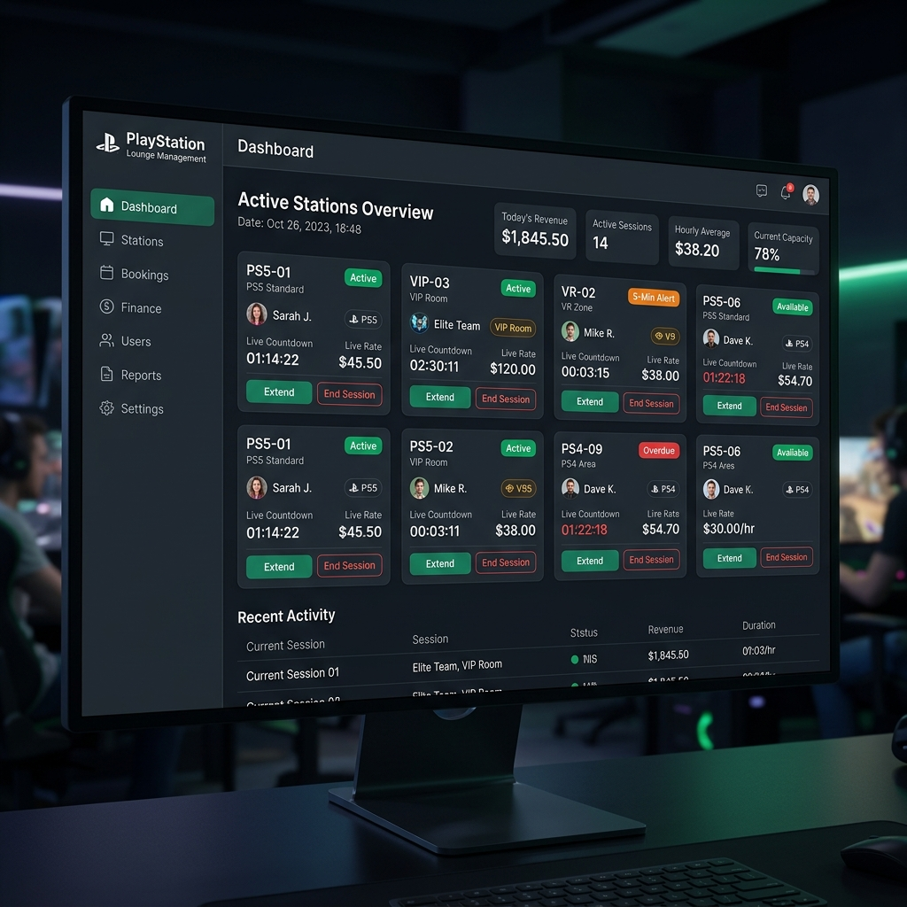
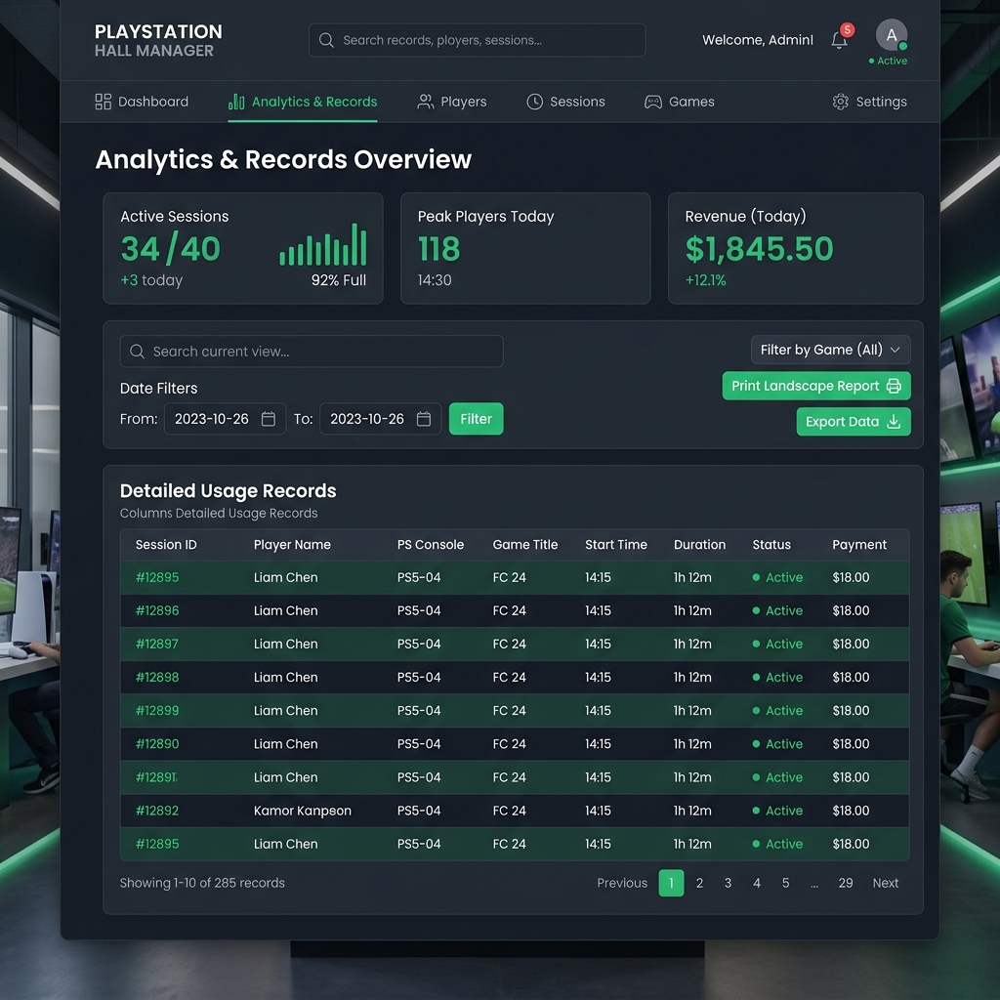

# 🎮 PlayStation Lounge & Reservation Management System

A comprehensive management system built with **React**, **TypeScript**, **Vite**, **Tailwind CSS**, and an **Express / SQLite backend** designed specifically for PlayStation gaming halls, lounges, and gaming cafes.

---

## 🖼️ Application Screenshots

### 📊 Live Gaming Lounge Dashboard


### 📈 Records & Printable Landscape Analytics


---

## ✨ Features

- **🎮 Active Gaming Sessions Tracker**: Real-time live countdown timers, 5-minute notifications & delay fee tracking.
- **🏷️ Dynamic Station Categories**: Support for PS5, VIP Rooms, VR, PS4, and custom categories.
- **💰 Automatic Billing & Rate Calculation**: Track single/multi-player rates, snacks/vendor orders, and custom session extensions.
- **📄 Printable Landscape Reports**: Format and export custom filtered session tables to A4 landscape reports ready for printing.
- **💾 Dual Storage Architecture**: Operates with an Express + SQLite backend for reliable data storage with fallback client capabilities.
- **🎨 Dark Mode UI**: Modern dark theme with Tailwind CSS, glassmorphism UI elements, and responsive layout.

---

## 🛠️ Tech Stack

- **Frontend**: React 18, TypeScript, Vite, Tailwind CSS, Framer Motion, Lucide React
- **Backend**: Node.js, Express, SQLite3 (`better-sqlite3`)
- **Utilities**: `date-fns`, `uuid`, `clsx`, `tailwind-merge`

---

## 🚀 Getting Started

### 1. Install Dependencies

```bash
npm install
```

### 2. Run Application (Full Stack: Client + Server)

```bash
npm run dev:full
```

- **Client**: Runs on `http://localhost:5173`
- **Server**: Runs on `http://localhost:5000`

### Additional Scripts

- `npm run dev` - Launch Vite development server only
- `npm run server` - Launch Express backend server only
- `npm run build` - Build production bundle
- `npm run preview` - Preview production build locally

---

## 📄 License

This project is open source and available under the [MIT License](LICENSE).
